# ESM_project


- [<span class="toc-section-number">1</span> Original Path
  model](#original-path-model)
- [<span class="toc-section-number">2</span> Extended
  model](#extended-model)
- [<span class="toc-section-number">3</span> Within-between
  partitioning](#within-between-partitioning)
- [<span class="toc-section-number">4</span> Effect of
  stress](#effect-of-stress)
- [<span class="toc-section-number">5</span> Effect of
  business](#effect-of-business)
- [<span class="toc-section-number">6</span> Effect of
  Importance](#effect-of-importance)
- [<span class="toc-section-number">7</span>
  Participants](#participants)
- [<span class="toc-section-number">8</span> ](#section)
- [<span class="toc-section-number">9</span>
  Preprocessing](#preprocessing)
- [<span class="toc-section-number">10</span> Monitoring](#monitoring)
- [<span class="toc-section-number">11</span> Rescale
  offloading](#rescale-offloading)
- [<span class="toc-section-number">12</span> Reshaping](#reshaping)
- [<span class="toc-section-number">13</span> Some particiants have more
  or less intention per
  day](#some-particiants-have-more-or-less-intention-per-day)
- [<span class="toc-section-number">14</span>
  Distributions](#distributions)
- [<span class="toc-section-number">15</span> Check the intraclass
  correlation coefficient
  (ICC)](#check-the-intraclass-correlation-coefficient-icc)
- [<span class="toc-section-number">16</span> Test the effect of day on
  intention execution](#test-the-effect-of-day-on-intention-execution)
- [<span class="toc-section-number">17</span> Do people become more
  stressed as the go on with the
  study?](#do-people-become-more-stressed-as-the-go-on-with-the-study)
- [<span class="toc-section-number">18</span> Conditional effects of
  variables on PM](#conditional-effects-of-variables-on-pm)
- [<span class="toc-section-number">19</span> Results](#results)
- [<span class="toc-section-number">20</span> SEM - path model.
  Generalized linear-mixed effect path model - bayesian
  estimation](#sem---path-model-generalized-linear-mixed-effect-path-model---bayesian-estimation)
- [<span class="toc-section-number">21</span> Posterior
  summary](#posterior-summary)
- [<span class="toc-section-number">22</span> Path model
  results](#path-model-results)
- [<span class="toc-section-number">23</span> Moderation of Age group on
  between stress-within task monitoring
  path](#moderation-of-age-group-on-between-stress-within-task-monitoring-path)
- [<span class="toc-section-number">24</span> Plot moderation of Age
  group on between stress-within task monitoring
  path](#plot-moderation-of-age-group-on-between-stress-within-task-monitoring-path)
- [<span class="toc-section-number">25</span> Test the mediation of
  monitoring](#test-the-mediation-of-monitoring)
- [<span class="toc-section-number">26</span> Test moderated mediation -
  Age as moderator, off-loading as a
  mediator](#test-moderated-mediation---age-as-moderator-off-loading-as-a-mediator)
- [<span class="toc-section-number">27</span> Moderation
  model](#moderation-model)
- [<span class="toc-section-number">28</span> Plot
  moderation](#plot-moderation)
- [<span class="toc-section-number">29</span> Posterior predictive
  check](#posterior-predictive-check)
- [<span class="toc-section-number">30</span> Posterior predictive
  check](#posterior-predictive-check-1)
- [<span class="toc-section-number">31</span> Posterior predictive
  check](#posterior-predictive-check-2)

## Original Path model

This it the original path model to be tested :


## Extended model

This model can be extended to accommodate partition of variance between-
and within- participants:


## Within-between partitioning


## Effect of stress


## Effect of business


## Effect of Importance


``` r
# Import the data
#| include: false
#| message: false
#| warning: false
#| echo: false
cd<-getwd()

# file dir
file_dir<-"Originaldatensätze/R-Skript"

# young adults' dataset
YA_df<- read_spss(paste0(file_dir, "/ExpSamp_jungErw2.sav"))

# rename the age group
YA_df$agegroup<-"YA"

# check task_monitoring
hist(YA_df$esm_day_task_monitoring)
```

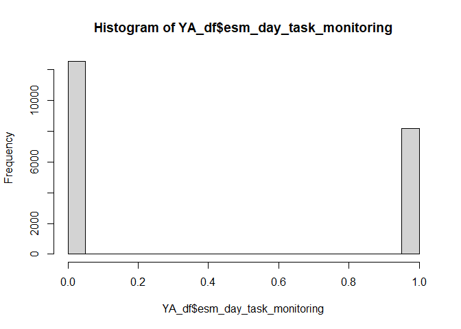

``` r
# middle-aged adults
MAA_df<-read_spss(paste0(file_dir, "/ExpSamp_mittlErw.sav"))

# rename the age group
MAA_df$agegroup<-"MAA"

# check task_monitoring
hist(YA_df$esm_day_task_monitoring)

# combine the two
all_df<-rbind(YA_df, MAA_df)
```

## Participants

``` r
all_df %>%
  distinct(ID, agegroup) %>%
  count(agegroup, name = "n_participants") %>%
  gt() %>%
  tab_header(
    title = "Participants by age group"
  )
```

<div id="cfzkjbajst" style="padding-left:0px;padding-right:0px;padding-top:10px;padding-bottom:10px;overflow-x:auto;overflow-y:auto;width:auto;height:auto;">
<style>#cfzkjbajst table {
  font-family: system-ui, 'Segoe UI', Roboto, Helvetica, Arial, sans-serif, 'Apple Color Emoji', 'Segoe UI Emoji', 'Segoe UI Symbol', 'Noto Color Emoji';
  -webkit-font-smoothing: antialiased;
  -moz-osx-font-smoothing: grayscale;
}
&#10;#cfzkjbajst thead, #cfzkjbajst tbody, #cfzkjbajst tfoot, #cfzkjbajst tr, #cfzkjbajst td, #cfzkjbajst th {
  border-style: none;
}
&#10;#cfzkjbajst p {
  margin: 0;
  padding: 0;
}
&#10;#cfzkjbajst .gt_table {
  display: table;
  border-collapse: collapse;
  line-height: normal;
  margin-left: auto;
  margin-right: auto;
  color: #333333;
  font-size: 16px;
  font-weight: normal;
  font-style: normal;
  background-color: #FFFFFF;
  width: auto;
  border-top-style: solid;
  border-top-width: 2px;
  border-top-color: #A8A8A8;
  border-right-style: none;
  border-right-width: 2px;
  border-right-color: #D3D3D3;
  border-bottom-style: solid;
  border-bottom-width: 2px;
  border-bottom-color: #A8A8A8;
  border-left-style: none;
  border-left-width: 2px;
  border-left-color: #D3D3D3;
}
&#10;#cfzkjbajst .gt_caption {
  padding-top: 4px;
  padding-bottom: 4px;
}
&#10;#cfzkjbajst .gt_title {
  color: #333333;
  font-size: 125%;
  font-weight: initial;
  padding-top: 4px;
  padding-bottom: 4px;
  padding-left: 5px;
  padding-right: 5px;
  border-bottom-color: #FFFFFF;
  border-bottom-width: 0;
}
&#10;#cfzkjbajst .gt_subtitle {
  color: #333333;
  font-size: 85%;
  font-weight: initial;
  padding-top: 3px;
  padding-bottom: 5px;
  padding-left: 5px;
  padding-right: 5px;
  border-top-color: #FFFFFF;
  border-top-width: 0;
}
&#10;#cfzkjbajst .gt_heading {
  background-color: #FFFFFF;
  text-align: center;
  border-bottom-color: #FFFFFF;
  border-left-style: none;
  border-left-width: 1px;
  border-left-color: #D3D3D3;
  border-right-style: none;
  border-right-width: 1px;
  border-right-color: #D3D3D3;
}
&#10;#cfzkjbajst .gt_bottom_border {
  border-bottom-style: solid;
  border-bottom-width: 2px;
  border-bottom-color: #D3D3D3;
}
&#10;#cfzkjbajst .gt_col_headings {
  border-top-style: solid;
  border-top-width: 2px;
  border-top-color: #D3D3D3;
  border-bottom-style: solid;
  border-bottom-width: 2px;
  border-bottom-color: #D3D3D3;
  border-left-style: none;
  border-left-width: 1px;
  border-left-color: #D3D3D3;
  border-right-style: none;
  border-right-width: 1px;
  border-right-color: #D3D3D3;
}
&#10;#cfzkjbajst .gt_col_heading {
  color: #333333;
  background-color: #FFFFFF;
  font-size: 100%;
  font-weight: normal;
  text-transform: inherit;
  border-left-style: none;
  border-left-width: 1px;
  border-left-color: #D3D3D3;
  border-right-style: none;
  border-right-width: 1px;
  border-right-color: #D3D3D3;
  vertical-align: bottom;
  padding-top: 5px;
  padding-bottom: 6px;
  padding-left: 5px;
  padding-right: 5px;
  overflow-x: hidden;
}
&#10;#cfzkjbajst .gt_column_spanner_outer {
  color: #333333;
  background-color: #FFFFFF;
  font-size: 100%;
  font-weight: normal;
  text-transform: inherit;
  padding-top: 0;
  padding-bottom: 0;
  padding-left: 4px;
  padding-right: 4px;
}
&#10;#cfzkjbajst .gt_column_spanner_outer:first-child {
  padding-left: 0;
}
&#10;#cfzkjbajst .gt_column_spanner_outer:last-child {
  padding-right: 0;
}
&#10;#cfzkjbajst .gt_column_spanner {
  border-bottom-style: solid;
  border-bottom-width: 2px;
  border-bottom-color: #D3D3D3;
  vertical-align: bottom;
  padding-top: 5px;
  padding-bottom: 5px;
  overflow-x: hidden;
  display: inline-block;
  width: 100%;
}
&#10;#cfzkjbajst .gt_spanner_row {
  border-bottom-style: hidden;
}
&#10;#cfzkjbajst .gt_group_heading {
  padding-top: 8px;
  padding-bottom: 8px;
  padding-left: 5px;
  padding-right: 5px;
  color: #333333;
  background-color: #FFFFFF;
  font-size: 100%;
  font-weight: initial;
  text-transform: inherit;
  border-top-style: solid;
  border-top-width: 2px;
  border-top-color: #D3D3D3;
  border-bottom-style: solid;
  border-bottom-width: 2px;
  border-bottom-color: #D3D3D3;
  border-left-style: none;
  border-left-width: 1px;
  border-left-color: #D3D3D3;
  border-right-style: none;
  border-right-width: 1px;
  border-right-color: #D3D3D3;
  vertical-align: middle;
  text-align: left;
}
&#10;#cfzkjbajst .gt_empty_group_heading {
  padding: 0.5px;
  color: #333333;
  background-color: #FFFFFF;
  font-size: 100%;
  font-weight: initial;
  border-top-style: solid;
  border-top-width: 2px;
  border-top-color: #D3D3D3;
  border-bottom-style: solid;
  border-bottom-width: 2px;
  border-bottom-color: #D3D3D3;
  vertical-align: middle;
}
&#10;#cfzkjbajst .gt_from_md > :first-child {
  margin-top: 0;
}
&#10;#cfzkjbajst .gt_from_md > :last-child {
  margin-bottom: 0;
}
&#10;#cfzkjbajst .gt_row {
  padding-top: 8px;
  padding-bottom: 8px;
  padding-left: 5px;
  padding-right: 5px;
  margin: 10px;
  border-top-style: solid;
  border-top-width: 1px;
  border-top-color: #D3D3D3;
  border-left-style: none;
  border-left-width: 1px;
  border-left-color: #D3D3D3;
  border-right-style: none;
  border-right-width: 1px;
  border-right-color: #D3D3D3;
  vertical-align: middle;
  overflow-x: hidden;
}
&#10;#cfzkjbajst .gt_stub {
  color: #333333;
  background-color: #FFFFFF;
  font-size: 100%;
  font-weight: initial;
  text-transform: inherit;
  border-right-style: solid;
  border-right-width: 2px;
  border-right-color: #D3D3D3;
  padding-left: 5px;
  padding-right: 5px;
}
&#10;#cfzkjbajst .gt_stub_row_group {
  color: #333333;
  background-color: #FFFFFF;
  font-size: 100%;
  font-weight: initial;
  text-transform: inherit;
  border-right-style: solid;
  border-right-width: 2px;
  border-right-color: #D3D3D3;
  padding-left: 5px;
  padding-right: 5px;
  vertical-align: top;
}
&#10;#cfzkjbajst .gt_row_group_first td {
  border-top-width: 2px;
}
&#10;#cfzkjbajst .gt_row_group_first th {
  border-top-width: 2px;
}
&#10;#cfzkjbajst .gt_summary_row {
  color: #333333;
  background-color: #FFFFFF;
  text-transform: inherit;
  padding-top: 8px;
  padding-bottom: 8px;
  padding-left: 5px;
  padding-right: 5px;
}
&#10;#cfzkjbajst .gt_first_summary_row {
  border-top-style: solid;
  border-top-color: #D3D3D3;
}
&#10;#cfzkjbajst .gt_first_summary_row.thick {
  border-top-width: 2px;
}
&#10;#cfzkjbajst .gt_last_summary_row {
  padding-top: 8px;
  padding-bottom: 8px;
  padding-left: 5px;
  padding-right: 5px;
  border-bottom-style: solid;
  border-bottom-width: 2px;
  border-bottom-color: #D3D3D3;
}
&#10;#cfzkjbajst .gt_grand_summary_row {
  color: #333333;
  background-color: #FFFFFF;
  text-transform: inherit;
  padding-top: 8px;
  padding-bottom: 8px;
  padding-left: 5px;
  padding-right: 5px;
}
&#10;#cfzkjbajst .gt_first_grand_summary_row {
  padding-top: 8px;
  padding-bottom: 8px;
  padding-left: 5px;
  padding-right: 5px;
  border-top-style: double;
  border-top-width: 6px;
  border-top-color: #D3D3D3;
}
&#10;#cfzkjbajst .gt_last_grand_summary_row_top {
  padding-top: 8px;
  padding-bottom: 8px;
  padding-left: 5px;
  padding-right: 5px;
  border-bottom-style: double;
  border-bottom-width: 6px;
  border-bottom-color: #D3D3D3;
}
&#10;#cfzkjbajst .gt_striped {
  background-color: rgba(128, 128, 128, 0.05);
}
&#10;#cfzkjbajst .gt_table_body {
  border-top-style: solid;
  border-top-width: 2px;
  border-top-color: #D3D3D3;
  border-bottom-style: solid;
  border-bottom-width: 2px;
  border-bottom-color: #D3D3D3;
}
&#10;#cfzkjbajst .gt_footnotes {
  color: #333333;
  background-color: #FFFFFF;
  border-bottom-style: none;
  border-bottom-width: 2px;
  border-bottom-color: #D3D3D3;
  border-left-style: none;
  border-left-width: 2px;
  border-left-color: #D3D3D3;
  border-right-style: none;
  border-right-width: 2px;
  border-right-color: #D3D3D3;
}
&#10;#cfzkjbajst .gt_footnote {
  margin: 0px;
  font-size: 90%;
  padding-top: 4px;
  padding-bottom: 4px;
  padding-left: 5px;
  padding-right: 5px;
}
&#10;#cfzkjbajst .gt_sourcenotes {
  color: #333333;
  background-color: #FFFFFF;
  border-bottom-style: none;
  border-bottom-width: 2px;
  border-bottom-color: #D3D3D3;
  border-left-style: none;
  border-left-width: 2px;
  border-left-color: #D3D3D3;
  border-right-style: none;
  border-right-width: 2px;
  border-right-color: #D3D3D3;
}
&#10;#cfzkjbajst .gt_sourcenote {
  font-size: 90%;
  padding-top: 4px;
  padding-bottom: 4px;
  padding-left: 5px;
  padding-right: 5px;
}
&#10;#cfzkjbajst .gt_left {
  text-align: left;
}
&#10;#cfzkjbajst .gt_center {
  text-align: center;
}
&#10;#cfzkjbajst .gt_right {
  text-align: right;
  font-variant-numeric: tabular-nums;
}
&#10;#cfzkjbajst .gt_font_normal {
  font-weight: normal;
}
&#10;#cfzkjbajst .gt_font_bold {
  font-weight: bold;
}
&#10;#cfzkjbajst .gt_font_italic {
  font-style: italic;
}
&#10;#cfzkjbajst .gt_super {
  font-size: 65%;
}
&#10;#cfzkjbajst .gt_footnote_marks {
  font-size: 75%;
  vertical-align: 0.4em;
  position: initial;
}
&#10;#cfzkjbajst .gt_asterisk {
  font-size: 100%;
  vertical-align: 0;
}
&#10;#cfzkjbajst .gt_indent_1 {
  text-indent: 5px;
}
&#10;#cfzkjbajst .gt_indent_2 {
  text-indent: 10px;
}
&#10;#cfzkjbajst .gt_indent_3 {
  text-indent: 15px;
}
&#10;#cfzkjbajst .gt_indent_4 {
  text-indent: 20px;
}
&#10;#cfzkjbajst .gt_indent_5 {
  text-indent: 25px;
}
&#10;#cfzkjbajst .katex-display {
  display: inline-flex !important;
  margin-bottom: 0.75em !important;
}
&#10;#cfzkjbajst div.Reactable > div.rt-table > div.rt-thead > div.rt-tr.rt-tr-group-header > div.rt-th-group:after {
  height: 0px !important;
}
</style>

| Participants by age group |                |
|---------------------------|----------------|
| agegroup                  | n_participants |
| MAA                       | 103            |
| YA                        | 107            |

</div>

``` r
# check the length of unique IDs
length(unique(all_df$ID))
```

    [1] 210

## 

the df looks like this:

    # A tibble: 20 × 15
       ID         day  time intention                esm_day_stress esm_day_business
       <chr>    <dbl> <dbl> <chr>                             <dbl>            <dbl>
     1 AM05UN20     1     1 Brief abgeben                         3                2
     2 AM05UN20     1     2 Brief abgeben                         4                3
     3 AM05UN20     1     3 Brief abgeben                         4                5
     4 AM05UN20     1     4 Brief abgeben                         4                4
     5 AM05UN20     1     5 Brief abgeben                        NA               NA
     6 AM05UN20     1     1 Präsentation fertigstel…              3                2
     7 AM05UN20     1     2 Präsentation fertigstel…              4                3
     8 AM05UN20     1     3 Präsentation fertigstel…              4                5
     9 AM05UN20     1     4 Präsentation fertigstel…              4                4
    10 AM05UN20     1     5 Präsentation fertigstel…             NA               NA
    11 AM05UN20     1     1 Geschwister treffen                   3                2
    12 AM05UN20     1     2 Geschwister treffen                   4                3
    13 AM05UN20     1     3 Geschwister treffen                   4                5
    14 AM05UN20     1     4 Geschwister treffen                   4                4
    15 AM05UN20     1     5 Geschwister treffen                  NA               NA
    16 AM05UN20     2     1 Kaffe trinken gehen                   2                2
    17 AM05UN20     2     2 Kaffe trinken gehen                   2                3
    18 AM05UN20     2     3 Kaffe trinken gehen                   4                4
    19 AM05UN20     2     4 Kaffe trinken gehen                   5                5
    20 AM05UN20     2     5 Kaffe trinken gehen                   5                5
    # ℹ 9 more variables: esm_day_task_monitoring <dbl>, esm_day_stress_avg <dbl>,
    #   esm_daybusiness_avg <dbl>, esm_day_task_monitoring_avg <dbl>,
    #   esm_evening_intention_importance_t1 <dbl>, esm_evening_off_loading <dbl>,
    #   esm_evening_intention_execution <dbl>, age_group <dbl>, agegroup <chr>

## Preprocessing

- Rescale PM to range between 0 and 1

``` r
all_df$esm_evening_intention_execution<-ifelse(all_df$esm_evening_intention_execution ==-1, 0, all_df$esm_evening_intention_execution)
```

## Monitoring

``` r
hist(all_df$esm_day_task_monitoring)
```

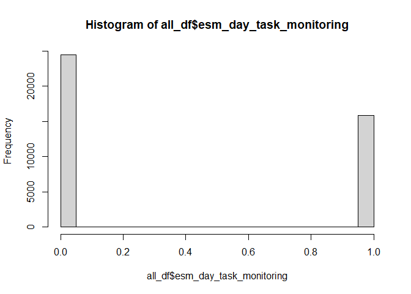

``` r
# all_df$esm_day_task_monitoring_r<-ifelse(all_df$esm_day_task_monitoring ==-1, 0, 
#                                          ifelse(all_df$esm_day_task_monitoring== 0, 0, 1))
```

## Rescale offloading

``` r
hist(all_df$esm_evening_off_loading)
```

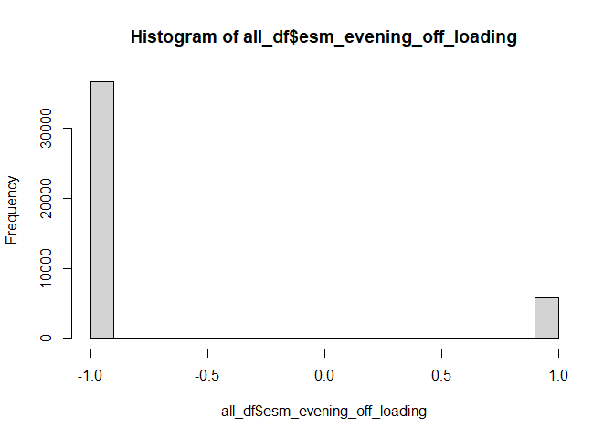

``` r
all_df$esm_evening_off_loading_r<-ifelse(all_df$esm_evening_off_loading ==-1, 0,1)

hist(all_df$esm_evening_off_loading_r)
```


## Reshaping

- The dataset as it is now is good to test hypotheses on the variables
  that vary within day, e.g. stress, business, monitoring.
- Reshape the dataset so there is only one unique intention per day,
  which is our base level.

RTeshaped dataset

    `summarise()` has grouped output by 'ID'. You can override using the `.groups`
    argument.

    # A tibble: 20 × 43
    # Groups:   ID, day, intention [20]
       ID         day  time intention                esm_day_stress esm_day_business
       <chr>    <dbl> <dbl> <chr>                             <dbl>            <dbl>
     1 AM05UN20     1     2 Brief abgeben                         4                3
     2 AM05UN20     1     1 Geschwister treffen                   3                2
     3 AM05UN20     1     2 Präsentation fertigstel…              4                3
     4 AM05UN20     2     4 Freund besuchen                       5                5
     5 AM05UN20     2     1 Kaffe trinken gehen                   2                2
     6 AM05UN20     2     2 telefonieren                          2                3
     7 AM05UN20     3     4 Präsentation fertigstel…              4                5
     8 AM05UN20     3     3 aufräumen                             4                5
     9 AM05UN20     3     1 mit Freundin spielen                  2                3
    10 AM05UN20     4     1 13 Uhr zum Geburtstag g…              3                4
    11 AM05UN20     4     2 mit guter Laune aufsteh…              4                5
    12 AM05UN20     4     1 nicht einschüchtern las…              3                4
    13 AM05UN20     5     4 18 Uhr bereitmachen für…              4                4
    14 AM05UN20     5     3 Motivation zeigen                     4                5
    15 AM05UN20     5     2 ausschlafen                           3                4
    16 AM05UN20     6     3 Praktikumsplatz suchen                4                4
    17 AM05UN20     6     4 Präsentation fertigstel…              5                4
    18 AM05UN20     6     4 mit Freunden treffen                  5                4
    19 AM05UN20     7     5 Präsentation fertigstel…              2                3
    20 AM05UN20     7     1 meinem Freund eine Freu…              5                5
    # ℹ 37 more variables: esm_day_task_monitoring <dbl>, esm_day_stress_avg <dbl>,
    #   esm_daybusiness_avg <dbl>, esm_day_task_monitoring_avg <dbl>,
    #   esm_evening_intention_importance_t1 <dbl>, esm_evening_off_loading <dbl>,
    #   esm_evening_intention_execution <dbl>, age_group <dbl>, agegroup <chr>,
    #   esm_evening_off_loading_r <dbl>, mean_stress <dbl>, mean_business <dbl>,
    #   grand_mean_esm_stress <dbl>, grand_sd_esm_stress <dbl>,
    #   grand_mean_esm_day_business <dbl>, grand_sd_esm_day_business <dbl>, …

## Some particiants have more or less intention per day

    [1] "Number of unique intentions per day"

    [1] 3 4 2 1

    [1] "Participants who reported 4 intentions in some days:"

     [1] "CH09LD19" "EK13AN09" "EL05AN19" "EL08TZ04" "EL09ST09" "ER06AH19"
     [7] "ER06SA06" "ER08IG13" "ER09AN17" "ER11RD06" "GG06ER28" "IA10CO01"
    [13] "IA10CO06" "KE06RD04" "LE05GI03" "LE05GI07" "LO08ZO13" "LU03IR19"
    [19] "LU17UZ09" "be08rd25"

## Distributions

``` r
library(tidyr)
```


    Attaching package: 'tidyr'

    The following objects are masked from 'package:Matrix':

        expand, pack, unpack

``` r
# Select the variables you want histograms for
df_selected <- stress_int_red %>%
  select(within_stress, within_importance, within_business, 
         within_off_loading, within_task_monitoring, 
         esm_evening_intention_execution,esm_day_task_monitoring,esm_evening_off_loading_r )  
```

    Adding missing grouping variables: `ID`, `day`, `intention`

``` r
df_selected<-df_selected[, c("within_stress", "within_importance", "within_business", 
                             "within_off_loading", "within_task_monitoring", 
                             "esm_evening_intention_execution", "esm_day_task_monitoring", 
                             "esm_evening_off_loading_r")]

# Convert to long format
df_long <- df_selected %>%
  pivot_longer(cols = everything(), names_to = "Variable", values_to = "Value")

# Plot all histograms in one go using facets
ggplot(df_long, aes(x = Value)) +
  geom_histogram(bins = 30, fill = "grey70", color = "black") +
  facet_wrap(~ Variable, scales = "free") +
  theme_classic()
```

    Warning: Removed 1960 rows containing non-finite outside the scale range
    (`stat_bin()`).

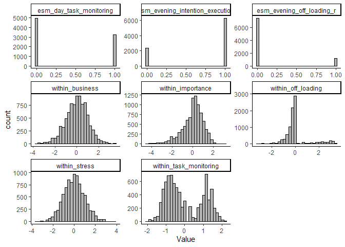

## Check the intraclass correlation coefficient (ICC)

``` r
PM_YA <- glmer(esm_evening_intention_execution ~ 1 + (1 | ID), 
               data = stress_int[stress_int$agegroup=="YA",], family = binomial)

PM_MAA <- glmer(esm_evening_intention_execution ~ 1 + (1 | ID), 
                data = stress_int[stress_int$agegroup=="MAA",], family = binomial)

print("ICC PM YA:")
```

    [1] "ICC PM YA:"

``` r
icc_YA<-icc(PM_YA)
icc_YA$ICC_adjusted
```

    [1] 0.1332206

``` r
print("ICC PM MAA:")
```

    [1] "ICC PM MAA:"

``` r
icc_MAA<-icc(PM_MAA)
icc_MAA$ICC_adjusted
```

    [1] 0.1889952

## Test the effect of day on intention execution

<table style="border-collapse:collapse; border:none;">
<tr>
<th style="border-top: double; text-align:center; font-style:normal; font-weight:bold; padding:0.2cm;  text-align:left; ">&nbsp;</th>
<th colspan="3" style="border-top: double; text-align:center; font-style:normal; font-weight:bold; padding:0.2cm; ">esm_evening_intention_execution</th>
</tr>
<tr>
<td style=" text-align:center; border-bottom:1px solid; font-style:italic; font-weight:normal;  text-align:left; ">Predictors</td>
<td style=" text-align:center; border-bottom:1px solid; font-style:italic; font-weight:normal;  ">Odds Ratios</td>
<td style=" text-align:center; border-bottom:1px solid; font-style:italic; font-weight:normal;  ">CI</td>
<td style=" text-align:center; border-bottom:1px solid; font-style:italic; font-weight:normal;  ">p</td>
</tr>
<tr>
<td style=" padding:0.2cm; text-align:left; vertical-align:top; text-align:left; ">(Intercept)</td>
<td style=" padding:0.2cm; text-align:left; vertical-align:top; text-align:center;  ">2.93</td>
<td style=" padding:0.2cm; text-align:left; vertical-align:top; text-align:center;  ">2.65&nbsp;&ndash;&nbsp;3.25</td>
<td style=" padding:0.2cm; text-align:left; vertical-align:top; text-align:center;  "><strong>&lt;0.001</strong></td>
</tr>
<tr>
<td style=" padding:0.2cm; text-align:left; vertical-align:top; text-align:left; ">day c</td>
<td style=" padding:0.2cm; text-align:left; vertical-align:top; text-align:center;  ">1.02</td>
<td style=" padding:0.2cm; text-align:left; vertical-align:top; text-align:center;  ">1.00&nbsp;&ndash;&nbsp;1.03</td>
<td style=" padding:0.2cm; text-align:left; vertical-align:top; text-align:center;  "><strong>0.032</strong></td>
</tr>
<tr>
<td style=" padding:0.2cm; text-align:left; vertical-align:top; text-align:left; ">agegroup c</td>
<td style=" padding:0.2cm; text-align:left; vertical-align:top; text-align:center;  ">1.46</td>
<td style=" padding:0.2cm; text-align:left; vertical-align:top; text-align:center;  ">1.20&nbsp;&ndash;&nbsp;1.79</td>
<td style=" padding:0.2cm; text-align:left; vertical-align:top; text-align:center;  "><strong>&lt;0.001</strong></td>
</tr>
<tr>
<td style=" padding:0.2cm; text-align:left; vertical-align:top; text-align:left; ">day c × agegroup c</td>
<td style=" padding:0.2cm; text-align:left; vertical-align:top; text-align:center;  ">0.99</td>
<td style=" padding:0.2cm; text-align:left; vertical-align:top; text-align:center;  ">0.96&nbsp;&ndash;&nbsp;1.02</td>
<td style=" padding:0.2cm; text-align:left; vertical-align:top; text-align:center;  ">0.518</td>
</tr>
<tr>
<td colspan="4" style="font-weight:bold; text-align:left; padding-top:.8em;">Random Effects</td>
</tr>
&#10;<tr>
<td style=" padding:0.2cm; text-align:left; vertical-align:top; text-align:left; padding-top:0.1cm; padding-bottom:0.1cm;">&sigma;<sup>2</sup></td>
<td style=" padding:0.2cm; text-align:left; vertical-align:top; padding-top:0.1cm; padding-bottom:0.1cm; text-align:left;" colspan="3">3.29</td>
</tr>
&#10;<tr>
<td style=" padding:0.2cm; text-align:left; vertical-align:top; text-align:left; padding-top:0.1cm; padding-bottom:0.1cm;">&tau;<sub>00</sub> <sub>ID</sub></td>
<td style=" padding:0.2cm; text-align:left; vertical-align:top; padding-top:0.1cm; padding-bottom:0.1cm; text-align:left;" colspan="3">0.42</td>
&#10;<tr>
<td style=" padding:0.2cm; text-align:left; vertical-align:top; text-align:left; padding-top:0.1cm; padding-bottom:0.1cm;">&tau;<sub>11</sub> <sub>ID.day.c</sub></td>
<td style=" padding:0.2cm; text-align:left; vertical-align:top; padding-top:0.1cm; padding-bottom:0.1cm; text-align:left;" colspan="3">0.00</td>
&#10;<tr>
<td style=" padding:0.2cm; text-align:left; vertical-align:top; text-align:left; padding-top:0.1cm; padding-bottom:0.1cm;">&rho;<sub>01</sub> <sub>ID</sub></td>
<td style=" padding:0.2cm; text-align:left; vertical-align:top; padding-top:0.1cm; padding-bottom:0.1cm; text-align:left;" colspan="3">0.07</td>
&#10;<tr>
<td style=" padding:0.2cm; text-align:left; vertical-align:top; text-align:left; padding-top:0.1cm; padding-bottom:0.1cm;">ICC</td>
<td style=" padding:0.2cm; text-align:left; vertical-align:top; padding-top:0.1cm; padding-bottom:0.1cm; text-align:left;" colspan="3">0.12</td>
&#10;<tr>
<td style=" padding:0.2cm; text-align:left; vertical-align:top; text-align:left; padding-top:0.1cm; padding-bottom:0.1cm;">N <sub>ID</sub></td>
<td style=" padding:0.2cm; text-align:left; vertical-align:top; padding-top:0.1cm; padding-bottom:0.1cm; text-align:left;" colspan="3">210</td>
<tr>
<td style=" padding:0.2cm; text-align:left; vertical-align:top; text-align:left; padding-top:0.1cm; padding-bottom:0.1cm; border-top:1px solid;">Observations</td>
<td style=" padding:0.2cm; text-align:left; vertical-align:top; padding-top:0.1cm; padding-bottom:0.1cm; text-align:left; border-top:1px solid;" colspan="3">8626</td>
</tr>
<tr>
<td style=" padding:0.2cm; text-align:left; vertical-align:top; text-align:left; padding-top:0.1cm; padding-bottom:0.1cm;">Marginal R<sup>2</sup> / Conditional R<sup>2</sup></td>
<td style=" padding:0.2cm; text-align:left; vertical-align:top; padding-top:0.1cm; padding-bottom:0.1cm; text-align:left;" colspan="3">0.011 / 0.127</td>
</tr>
&#10;</table>

## Do people become more stressed as the go on with the study?

``` r
stress_time_model<-lmer(esm_day_stress_avg ~ day.c*agegroup.c + (day.c|ID), 
                        data = stress_int_red, 
                        control=lmerControl(optimizer="bobyqa",optCtrl=list(maxfun=100000)) )

tab_model(stress_time_model)
```

<table style="border-collapse:collapse; border:none;">
<tr>
<th style="border-top: double; text-align:center; font-style:normal; font-weight:bold; padding:0.2cm;  text-align:left; ">&nbsp;</th>
<th colspan="3" style="border-top: double; text-align:center; font-style:normal; font-weight:bold; padding:0.2cm; ">esm_day_stress_avg</th>
</tr>
<tr>
<td style=" text-align:center; border-bottom:1px solid; font-style:italic; font-weight:normal;  text-align:left; ">Predictors</td>
<td style=" text-align:center; border-bottom:1px solid; font-style:italic; font-weight:normal;  ">Estimates</td>
<td style=" text-align:center; border-bottom:1px solid; font-style:italic; font-weight:normal;  ">CI</td>
<td style=" text-align:center; border-bottom:1px solid; font-style:italic; font-weight:normal;  ">p</td>
</tr>
<tr>
<td style=" padding:0.2cm; text-align:left; vertical-align:top; text-align:left; ">(Intercept)</td>
<td style=" padding:0.2cm; text-align:left; vertical-align:top; text-align:center;  ">2.44</td>
<td style=" padding:0.2cm; text-align:left; vertical-align:top; text-align:center;  ">2.37&nbsp;&ndash;&nbsp;2.52</td>
<td style=" padding:0.2cm; text-align:left; vertical-align:top; text-align:center;  "><strong>&lt;0.001</strong></td>
</tr>
<tr>
<td style=" padding:0.2cm; text-align:left; vertical-align:top; text-align:left; ">day c</td>
<td style=" padding:0.2cm; text-align:left; vertical-align:top; text-align:center;  ">0.01</td>
<td style=" padding:0.2cm; text-align:left; vertical-align:top; text-align:center;  ">0.01&nbsp;&ndash;&nbsp;0.02</td>
<td style=" padding:0.2cm; text-align:left; vertical-align:top; text-align:center;  "><strong>0.001</strong></td>
</tr>
<tr>
<td style=" padding:0.2cm; text-align:left; vertical-align:top; text-align:left; ">agegroup c</td>
<td style=" padding:0.2cm; text-align:left; vertical-align:top; text-align:center;  ">&#45;0.01</td>
<td style=" padding:0.2cm; text-align:left; vertical-align:top; text-align:center;  ">&#45;0.16&nbsp;&ndash;&nbsp;0.14</td>
<td style=" padding:0.2cm; text-align:left; vertical-align:top; text-align:center;  ">0.869</td>
</tr>
<tr>
<td style=" padding:0.2cm; text-align:left; vertical-align:top; text-align:left; ">day c × agegroup c</td>
<td style=" padding:0.2cm; text-align:left; vertical-align:top; text-align:center;  ">&#45;0.01</td>
<td style=" padding:0.2cm; text-align:left; vertical-align:top; text-align:center;  ">&#45;0.02&nbsp;&ndash;&nbsp;0.01</td>
<td style=" padding:0.2cm; text-align:left; vertical-align:top; text-align:center;  ">0.293</td>
</tr>
<tr>
<td colspan="4" style="font-weight:bold; text-align:left; padding-top:.8em;">Random Effects</td>
</tr>
&#10;<tr>
<td style=" padding:0.2cm; text-align:left; vertical-align:top; text-align:left; padding-top:0.1cm; padding-bottom:0.1cm;">&sigma;<sup>2</sup></td>
<td style=" padding:0.2cm; text-align:left; vertical-align:top; padding-top:0.1cm; padding-bottom:0.1cm; text-align:left;" colspan="3">0.34</td>
</tr>
&#10;<tr>
<td style=" padding:0.2cm; text-align:left; vertical-align:top; text-align:left; padding-top:0.1cm; padding-bottom:0.1cm;">&tau;<sub>00</sub> <sub>ID</sub></td>
<td style=" padding:0.2cm; text-align:left; vertical-align:top; padding-top:0.1cm; padding-bottom:0.1cm; text-align:left;" colspan="3">0.29</td>
&#10;<tr>
<td style=" padding:0.2cm; text-align:left; vertical-align:top; text-align:left; padding-top:0.1cm; padding-bottom:0.1cm;">&tau;<sub>11</sub> <sub>ID.day.c</sub></td>
<td style=" padding:0.2cm; text-align:left; vertical-align:top; padding-top:0.1cm; padding-bottom:0.1cm; text-align:left;" colspan="3">0.00</td>
&#10;<tr>
<td style=" padding:0.2cm; text-align:left; vertical-align:top; text-align:left; padding-top:0.1cm; padding-bottom:0.1cm;">&rho;<sub>01</sub> <sub>ID</sub></td>
<td style=" padding:0.2cm; text-align:left; vertical-align:top; padding-top:0.1cm; padding-bottom:0.1cm; text-align:left;" colspan="3">0.03</td>
&#10;<tr>
<td style=" padding:0.2cm; text-align:left; vertical-align:top; text-align:left; padding-top:0.1cm; padding-bottom:0.1cm;">ICC</td>
<td style=" padding:0.2cm; text-align:left; vertical-align:top; padding-top:0.1cm; padding-bottom:0.1cm; text-align:left;" colspan="3">0.49</td>
&#10;<tr>
<td style=" padding:0.2cm; text-align:left; vertical-align:top; text-align:left; padding-top:0.1cm; padding-bottom:0.1cm;">N <sub>ID</sub></td>
<td style=" padding:0.2cm; text-align:left; vertical-align:top; padding-top:0.1cm; padding-bottom:0.1cm; text-align:left;" colspan="3">210</td>
<tr>
<td style=" padding:0.2cm; text-align:left; vertical-align:top; text-align:left; padding-top:0.1cm; padding-bottom:0.1cm; border-top:1px solid;">Observations</td>
<td style=" padding:0.2cm; text-align:left; vertical-align:top; padding-top:0.1cm; padding-bottom:0.1cm; text-align:left; border-top:1px solid;" colspan="3">8622</td>
</tr>
<tr>
<td style=" padding:0.2cm; text-align:left; vertical-align:top; text-align:left; padding-top:0.1cm; padding-bottom:0.1cm;">Marginal R<sup>2</sup> / Conditional R<sup>2</sup></td>
<td style=" padding:0.2cm; text-align:left; vertical-align:top; padding-top:0.1cm; padding-bottom:0.1cm; text-align:left;" colspan="3">0.004 / 0.492</td>
</tr>
&#10;</table>

## Conditional effects of variables on PM

Test the conditional effects of the variables on PM

``` r
# predict PM by all the predictors
PM_model<- glmer(esm_evening_intention_execution ~ 
                   # within factors
                   within_off_loading+
                   within_importance +
                   within_task_monitoring+
                   within_business+
                   within_stress+
                   # between factors
                   between_off_loading+
                   between_importance+
                   between_task_monitoring+
                   between_business+
                   between_stress+  
                   # age
                   agegroup.c +  
                   # day number as covariate
                   day.c+
                   # random effects
                   (1 within_off_loading+
                      within_importance +
                      within_task_monitoring+within_business+day.c| ID),
                 data = stress_int_red, family = binomial,
                 control=glmerControl(optimizer="bobyqa",optCtrl=list(maxfun=100000)) 
)
```

## Results

## SEM - path model. Generalized linear-mixed effect path model - bayesian estimation

``` r
# first, we predict PM from all the predictors
PM_model <-bf(esm_evening_intention_execution ~  # fixed effects 
                within_stress*agegroup.c + 
                within_importance*agegroup.c + 
                within_task_monitoring*agegroup.c + 
                within_off_loading*agegroup.c +
                within_business*agegroup.c+
                between_stress*agegroup.c + 
                between_task_monitoring*agegroup.c + 
                between_off_loading*agegroup.c +
                between_importance*agegroup.c+
                between_business*agegroup.c+day.c+
                (1 + within_stress +
                   within_business+
                   within_importance + 
                   within_task_monitoring + 
                   within_off_loading || ID), # random intercepts and slopes
              family = bernoulli()) # we have a binary outcome

# predicting monitoring from stress and importance
monitoring_model<- bf(esm_day_task_monitoring ~ 
                        within_stress*agegroup.c +
                        within_importance*agegroup.c +
                        within_business*agegroup.c+
                        between_stress*agegroup.c+
                        between_importance*agegroup.c+
                        between_business+day.c+
                        (1+within_stress+
                           within_business+
                           within_importance+
                           day.c||ID), 
                      family = bernoulli()) # mixture

# predicing off_loading from stress and imortance
offloading_model<-bf(esm_evening_off_loading_r ~ 
                       within_stress*agegroup.c +
                       within_importance*agegroup.c+
                       within_business*agegroup.c+
                       between_stress*agegroup.c+
                       between_importance*agegroup.c+
                       between_business*agegroup.c+ day.c+
                       (1+within_stress+
                          within_importance+
                          within_business+
                          day.c||ID), family = bernoulli() )#

# set weakly informative priors
priors <- c(
  # Fixed effects: assume standardized predictors
  prior(normal(0, 0.5), class = "b", resp = "esmeveningintentionexecution"),   
  prior(normal(0, 0.5), class = "b", resp = "esmdaytaskmonitoring"),  
  prior(normal(0, 0.5), class = "b", resp = "esmeveningoffloadingr")   
  
# all the rest is left as defauls
 #  
 #  # SD of random effects (hierarchical structure)
 #   prior( student_t(3, 0, 2.5) , class = "sd", resp = "esmeveningintentionexecution"),
 #  prior(student_t(3, 0, 2.5) , class = "sd", resp = "esmdaytaskmonitoring"),
 #   prior(student_t(3, 0, 2.5), class = "sd", resp = "esmeveningoffloadingr"),
 #  #
 #  # Correlation priors among random effects
 # # prior(lkj(2), class = "cor"),  # same across responses
 # 
 #  # Residual SDs for continuous outcomes
 #  prior(exponential(1), class = "sigma", resp = "esmdaytaskmonitoring"),
 #  prior(exponential(1), class = "sigma", resp = "esmeveningoffloadingr")
)


# fit thestress_int_red# fit the model
fit1 <- brm(
  PM_model+
    monitoring_model + 
    offloading_model + 
    set_rescor(F), 
  prior = priors,
  sample_prior = "yes",
  data = stress_int_red,
  chains = 4, cores = 4,
  iter = 2000, 
  warmup = 1000
  #,backend = "cmdstanr"  
)
```

## Posterior summary

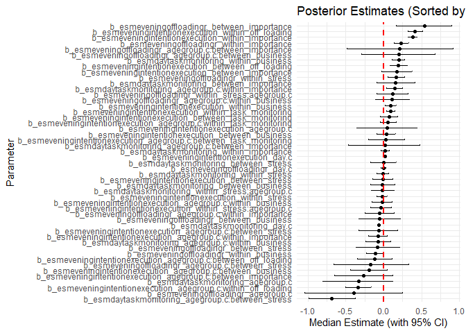

    Warning: package 'ggdist' was built under R version 4.4.3


    Attaching package: 'ggdist'

    The following object is masked from 'package:bayestestR':

        hdi

    The following objects are masked from 'package:brms':

        dstudent_t, pstudent_t, qstudent_t, rstudent_t

## Path model results


## Moderation of Age group on between stress-within task monitoring path

``` r
int_mod_stess_mon<-glmer(esm_day_task_monitoring~between_stress*agegroup +(1|ID),
               family = binomial(),
               data = stress_int_red, )


tab_model(int_mod_stess_mon)
```

<table style="border-collapse:collapse; border:none;">
<tr>
<th style="border-top: double; text-align:center; font-style:normal; font-weight:bold; padding:0.2cm;  text-align:left; ">&nbsp;</th>
<th colspan="3" style="border-top: double; text-align:center; font-style:normal; font-weight:bold; padding:0.2cm; ">esm_day_task_monitoring</th>
</tr>
<tr>
<td style=" text-align:center; border-bottom:1px solid; font-style:italic; font-weight:normal;  text-align:left; ">Predictors</td>
<td style=" text-align:center; border-bottom:1px solid; font-style:italic; font-weight:normal;  ">Odds Ratios</td>
<td style=" text-align:center; border-bottom:1px solid; font-style:italic; font-weight:normal;  ">CI</td>
<td style=" text-align:center; border-bottom:1px solid; font-style:italic; font-weight:normal;  ">p</td>
</tr>
<tr>
<td style=" padding:0.2cm; text-align:left; vertical-align:top; text-align:left; ">(Intercept)</td>
<td style=" padding:0.2cm; text-align:left; vertical-align:top; text-align:center;  ">0.59</td>
<td style=" padding:0.2cm; text-align:left; vertical-align:top; text-align:center;  ">0.49&nbsp;&ndash;&nbsp;0.71</td>
<td style=" padding:0.2cm; text-align:left; vertical-align:top; text-align:center;  "><strong>&lt;0.001</strong></td>
</tr>
<tr>
<td style=" padding:0.2cm; text-align:left; vertical-align:top; text-align:left; ">between stress</td>
<td style=" padding:0.2cm; text-align:left; vertical-align:top; text-align:center;  ">0.69</td>
<td style=" padding:0.2cm; text-align:left; vertical-align:top; text-align:center;  ">0.58&nbsp;&ndash;&nbsp;0.83</td>
<td style=" padding:0.2cm; text-align:left; vertical-align:top; text-align:center;  "><strong>&lt;0.001</strong></td>
</tr>
<tr>
<td style=" padding:0.2cm; text-align:left; vertical-align:top; text-align:left; ">agegroup [YA]</td>
<td style=" padding:0.2cm; text-align:left; vertical-align:top; text-align:center;  ">1.09</td>
<td style=" padding:0.2cm; text-align:left; vertical-align:top; text-align:center;  ">0.83&nbsp;&ndash;&nbsp;1.42</td>
<td style=" padding:0.2cm; text-align:left; vertical-align:top; text-align:center;  ">0.536</td>
</tr>
<tr>
<td style=" padding:0.2cm; text-align:left; vertical-align:top; text-align:left; ">between stress × agegroup<br>[YA]</td>
<td style=" padding:0.2cm; text-align:left; vertical-align:top; text-align:center;  ">2.08</td>
<td style=" padding:0.2cm; text-align:left; vertical-align:top; text-align:center;  ">1.57&nbsp;&ndash;&nbsp;2.76</td>
<td style=" padding:0.2cm; text-align:left; vertical-align:top; text-align:center;  "><strong>&lt;0.001</strong></td>
</tr>
<tr>
<td colspan="4" style="font-weight:bold; text-align:left; padding-top:.8em;">Random Effects</td>
</tr>
&#10;<tr>
<td style=" padding:0.2cm; text-align:left; vertical-align:top; text-align:left; padding-top:0.1cm; padding-bottom:0.1cm;">&sigma;<sup>2</sup></td>
<td style=" padding:0.2cm; text-align:left; vertical-align:top; padding-top:0.1cm; padding-bottom:0.1cm; text-align:left;" colspan="3">3.29</td>
</tr>
&#10;<tr>
<td style=" padding:0.2cm; text-align:left; vertical-align:top; text-align:left; padding-top:0.1cm; padding-bottom:0.1cm;">&tau;<sub>00</sub> <sub>ID</sub></td>
<td style=" padding:0.2cm; text-align:left; vertical-align:top; padding-top:0.1cm; padding-bottom:0.1cm; text-align:left;" colspan="3">0.82</td>
&#10;<tr>
<td style=" padding:0.2cm; text-align:left; vertical-align:top; text-align:left; padding-top:0.1cm; padding-bottom:0.1cm;">ICC</td>
<td style=" padding:0.2cm; text-align:left; vertical-align:top; padding-top:0.1cm; padding-bottom:0.1cm; text-align:left;" colspan="3">0.20</td>
&#10;<tr>
<td style=" padding:0.2cm; text-align:left; vertical-align:top; text-align:left; padding-top:0.1cm; padding-bottom:0.1cm;">N <sub>ID</sub></td>
<td style=" padding:0.2cm; text-align:left; vertical-align:top; padding-top:0.1cm; padding-bottom:0.1cm; text-align:left;" colspan="3">210</td>
<tr>
<td style=" padding:0.2cm; text-align:left; vertical-align:top; text-align:left; padding-top:0.1cm; padding-bottom:0.1cm; border-top:1px solid;">Observations</td>
<td style=" padding:0.2cm; text-align:left; vertical-align:top; padding-top:0.1cm; padding-bottom:0.1cm; text-align:left; border-top:1px solid;" colspan="3">8171</td>
</tr>
<tr>
<td style=" padding:0.2cm; text-align:left; vertical-align:top; text-align:left; padding-top:0.1cm; padding-bottom:0.1cm;">Marginal R<sup>2</sup> / Conditional R<sup>2</sup></td>
<td style=" padding:0.2cm; text-align:left; vertical-align:top; padding-top:0.1cm; padding-bottom:0.1cm; text-align:left;" colspan="3">0.032 / 0.225</td>
</tr>
&#10;</table>

``` r
int_mod_stress_mon<-glmer(esm_day_task_monitoring~day.c+ esm_day_stress*agegroup +(1+day.c+esm_day_stress|ID),
               family = binomial(),
               data = stress_int_red )
```

    boundary (singular) fit: see help('isSingular')

``` r
tab_model(int_mod_stress_mon)
```

<table style="border-collapse:collapse; border:none;">
<tr>
<th style="border-top: double; text-align:center; font-style:normal; font-weight:bold; padding:0.2cm;  text-align:left; ">&nbsp;</th>
<th colspan="3" style="border-top: double; text-align:center; font-style:normal; font-weight:bold; padding:0.2cm; ">esm_day_task_monitoring</th>
</tr>
<tr>
<td style=" text-align:center; border-bottom:1px solid; font-style:italic; font-weight:normal;  text-align:left; ">Predictors</td>
<td style=" text-align:center; border-bottom:1px solid; font-style:italic; font-weight:normal;  ">Odds Ratios</td>
<td style=" text-align:center; border-bottom:1px solid; font-style:italic; font-weight:normal;  ">CI</td>
<td style=" text-align:center; border-bottom:1px solid; font-style:italic; font-weight:normal;  ">p</td>
</tr>
<tr>
<td style=" padding:0.2cm; text-align:left; vertical-align:top; text-align:left; ">(Intercept)</td>
<td style=" padding:0.2cm; text-align:left; vertical-align:top; text-align:center;  ">0.52</td>
<td style=" padding:0.2cm; text-align:left; vertical-align:top; text-align:center;  ">0.40&nbsp;&ndash;&nbsp;0.68</td>
<td style=" padding:0.2cm; text-align:left; vertical-align:top; text-align:center;  "><strong>&lt;0.001</strong></td>
</tr>
<tr>
<td style=" padding:0.2cm; text-align:left; vertical-align:top; text-align:left; ">day c</td>
<td style=" padding:0.2cm; text-align:left; vertical-align:top; text-align:center;  ">0.93</td>
<td style=" padding:0.2cm; text-align:left; vertical-align:top; text-align:center;  ">0.92&nbsp;&ndash;&nbsp;0.94</td>
<td style=" padding:0.2cm; text-align:left; vertical-align:top; text-align:center;  "><strong>&lt;0.001</strong></td>
</tr>
<tr>
<td style=" padding:0.2cm; text-align:left; vertical-align:top; text-align:left; ">esm day stress</td>
<td style=" padding:0.2cm; text-align:left; vertical-align:top; text-align:center;  ">1.06</td>
<td style=" padding:0.2cm; text-align:left; vertical-align:top; text-align:center;  ">0.97&nbsp;&ndash;&nbsp;1.17</td>
<td style=" padding:0.2cm; text-align:left; vertical-align:top; text-align:center;  ">0.199</td>
</tr>
<tr>
<td style=" padding:0.2cm; text-align:left; vertical-align:top; text-align:left; ">agegroup [YA]</td>
<td style=" padding:0.2cm; text-align:left; vertical-align:top; text-align:center;  ">0.48</td>
<td style=" padding:0.2cm; text-align:left; vertical-align:top; text-align:center;  ">0.34&nbsp;&ndash;&nbsp;0.69</td>
<td style=" padding:0.2cm; text-align:left; vertical-align:top; text-align:center;  "><strong>&lt;0.001</strong></td>
</tr>
<tr>
<td style=" padding:0.2cm; text-align:left; vertical-align:top; text-align:left; ">esm day stress × agegroup<br>[YA]</td>
<td style=" padding:0.2cm; text-align:left; vertical-align:top; text-align:center;  ">1.36</td>
<td style=" padding:0.2cm; text-align:left; vertical-align:top; text-align:center;  ">1.19&nbsp;&ndash;&nbsp;1.55</td>
<td style=" padding:0.2cm; text-align:left; vertical-align:top; text-align:center;  "><strong>&lt;0.001</strong></td>
</tr>
<tr>
<td colspan="4" style="font-weight:bold; text-align:left; padding-top:.8em;">Random Effects</td>
</tr>
&#10;<tr>
<td style=" padding:0.2cm; text-align:left; vertical-align:top; text-align:left; padding-top:0.1cm; padding-bottom:0.1cm;">&sigma;<sup>2</sup></td>
<td style=" padding:0.2cm; text-align:left; vertical-align:top; padding-top:0.1cm; padding-bottom:0.1cm; text-align:left;" colspan="3">3.29</td>
</tr>
&#10;<tr>
<td style=" padding:0.2cm; text-align:left; vertical-align:top; text-align:left; padding-top:0.1cm; padding-bottom:0.1cm;">&tau;<sub>00</sub> <sub>ID</sub></td>
<td style=" padding:0.2cm; text-align:left; vertical-align:top; padding-top:0.1cm; padding-bottom:0.1cm; text-align:left;" colspan="3">0.96</td>
&#10;<tr>
<td style=" padding:0.2cm; text-align:left; vertical-align:top; text-align:left; padding-top:0.1cm; padding-bottom:0.1cm;">&tau;<sub>11</sub> <sub>ID.day.c</sub></td>
<td style=" padding:0.2cm; text-align:left; vertical-align:top; padding-top:0.1cm; padding-bottom:0.1cm; text-align:left;" colspan="3">0.00</td>
&#10;<tr>
<td style=" padding:0.2cm; text-align:left; vertical-align:top; text-align:left; padding-top:0.1cm; padding-bottom:0.1cm;">&tau;<sub>11</sub> <sub>ID.esm_day_stress</sub></td>
<td style=" padding:0.2cm; text-align:left; vertical-align:top; padding-top:0.1cm; padding-bottom:0.1cm; text-align:left;" colspan="3">0.11</td>
&#10;<tr>
<td style=" padding:0.2cm; text-align:left; vertical-align:top; text-align:left; padding-top:0.1cm; padding-bottom:0.1cm;">&rho;<sub>01</sub></td>
<td style=" padding:0.2cm; text-align:left; vertical-align:top; padding-top:0.1cm; padding-bottom:0.1cm; text-align:left;" colspan="3">1.00</td>
&#10;<tr>
<td style=" padding:0.2cm; text-align:left; vertical-align:top; text-align:left; padding-top:0.1cm; padding-bottom:0.1cm;"></td>
<td style=" padding:0.2cm; text-align:left; vertical-align:top; padding-top:0.1cm; padding-bottom:0.1cm; text-align:left;" colspan="3">-0.45</td>
&#10;<tr>
<td style=" padding:0.2cm; text-align:left; vertical-align:top; text-align:left; padding-top:0.1cm; padding-bottom:0.1cm;">N <sub>ID</sub></td>
<td style=" padding:0.2cm; text-align:left; vertical-align:top; padding-top:0.1cm; padding-bottom:0.1cm; text-align:left;" colspan="3">210</td>
<tr>
<td style=" padding:0.2cm; text-align:left; vertical-align:top; text-align:left; padding-top:0.1cm; padding-bottom:0.1cm; border-top:1px solid;">Observations</td>
<td style=" padding:0.2cm; text-align:left; vertical-align:top; padding-top:0.1cm; padding-bottom:0.1cm; text-align:left; border-top:1px solid;" colspan="3">8171</td>
</tr>
<tr>
<td style=" padding:0.2cm; text-align:left; vertical-align:top; text-align:left; padding-top:0.1cm; padding-bottom:0.1cm;">Marginal R<sup>2</sup> / Conditional R<sup>2</sup></td>
<td style=" padding:0.2cm; text-align:left; vertical-align:top; padding-top:0.1cm; padding-bottom:0.1cm; text-align:left;" colspan="3">0.049 / NA</td>
</tr>
&#10;</table>

``` r
interact_plot(int_mod_stress_mon, pred = esm_day_stress, modx = agegroup)
```

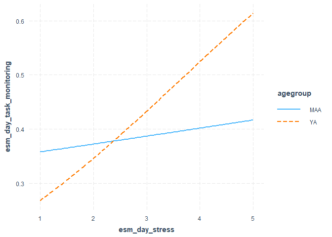

``` r
 ggplot(stress_int_red, 
         aes( x=esm_day_stress, y=esm_day_task_monitoring))+
  # add the "smooth" line, which the regression method ('l,')
  # and trasparent (0.5)
    geom_line(stat="smooth",method = "glm", formula=y~x, alpha=0.5, se=F)+

  # specify that we want different colours for different participants
    aes(colour = factor(ID))+
  # add the summary line with geom_smooth
    geom_smooth(method="lm",formula=y~x, se=T, colour = "black" )+
    theme(strip.text.x = element_text(size = 13))+
    theme_classic()+
    theme(panel.spacing = unit(1, "lines"))+
    facet_wrap(.~agegroup)+
    #ggtitle("Experiment 2")+
    theme(legend.position = "none")
```

    Warning: Removed 635 rows containing non-finite outside the scale range
    (`stat_smooth()`).
    Removed 635 rows containing non-finite outside the scale range
    (`stat_smooth()`).

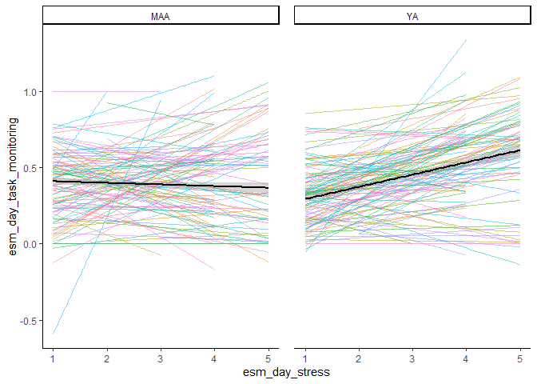

## Plot moderation of Age group on between stress-within task monitoring path

``` r
library(interactions)
interact_plot(int_mod_stess_mon, pred = between_stress, modx = agegroup)
```

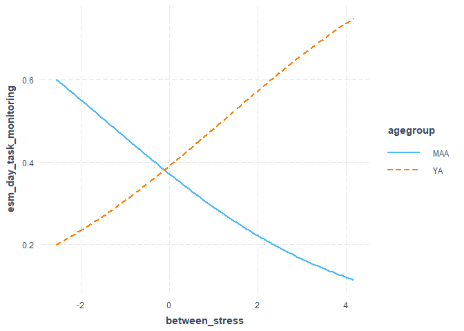

## Test the mediation of monitoring

``` r
h_business_monitoring<-hypothesis(fit1,  c("esmeveningintentionexecution_within_task_monitoring*esmdaytaskmonitoring_within_business =0"  ))

plot(h_business_monitoring)
```

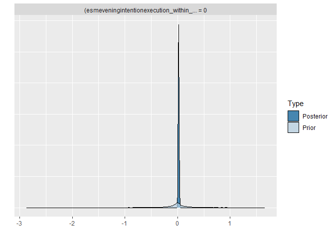

``` r
print(h_business_monitoring)
```

    Hypothesis Tests for class b:
                    Hypothesis Estimate Est.Error CI.Lower CI.Upper Evid.Ratio
    1 (esmeveningintent... = 0     0.02      0.01     0.01     0.03       0.18
      Post.Prob Star
    1      0.15    *
    ---
    'CI': 90%-CI for one-sided and 95%-CI for two-sided hypotheses.
    '*': For one-sided hypotheses, the posterior probability exceeds 95%;
    for two-sided hypotheses, the value tested against lies outside the 95%-CI.
    Posterior probabilities of point hypotheses assume equal prior probabilities.

``` r
print(paste0("Bayes Factor for ", "h_mediation"," is ", 1/h_business_monitoring$hypothesis$Evid.Ratio))
```

    [1] "Bayes Factor for h_mediation is 5.59110879380979"

## Test moderated mediation - Age as moderator, off-loading as a mediator

``` r
h_moderated_mediation<-hypothesis(fit1,  c("esmeveningintentionexecution_agegroup.c:within_off_loading* esmeveningoffloadingr_within_importance = 0"  ))

BF_moderated_med<-1/h_moderated_mediation$hypothesis$Evid.Ratio
print(paste0("Bayes Factor for ", "h_moderated_mediation"," is ", 1/h_moderated_mediation$hypothesis$Evid.Ratio))
```

## Moderation model

    Generalized linear mixed model fit by maximum likelihood (Laplace
      Approximation) [glmerMod]
     Family: binomial  ( logit )
    Formula: esm_evening_intention_execution ~ within_off_loading * agegroup +  
        (within_off_loading | ID)
       Data: stress_int_red

         AIC      BIC   logLik deviance df.resid 
      9571.4   9620.9  -4778.7   9557.4     8619 

    Scaled residuals: 
        Min      1Q  Median      3Q     Max 
    -3.6160 -0.9707  0.4621  0.6220  2.0074 

    Random effects:
     Groups Name               Variance Std.Dev. Corr 
     ID     (Intercept)        0.43321  0.6582        
            within_off_loading 0.06023  0.2454   -0.42
    Number of obs: 8626, groups:  ID, 210

    Fixed effects:
                                  Estimate Std. Error z value Pr(>|z|)    
    (Intercept)                    1.29017    0.07643  16.880  < 2e-16 ***
    within_off_loading             0.23164    0.05461   4.242 2.22e-05 ***
    agegroupYA                    -0.34823    0.10549  -3.301 0.000963 ***
    within_off_loading:agegroupYA  0.33695    0.08180   4.119 3.80e-05 ***
    ---
    Signif. codes:  0 '***' 0.001 '**' 0.01 '*' 0.05 '.' 0.1 ' ' 1

    Correlation of Fixed Effects:
                (Intr) wthn__ aggrYA
    wthn_ff_ldn -0.084              
    agegroupYA  -0.714  0.081       
    wthn_ff_:YA  0.080 -0.606 -0.068

## Plot moderation

``` r
interact_plot(int_mod, pred = within_off_loading, modx = agegroup)
```

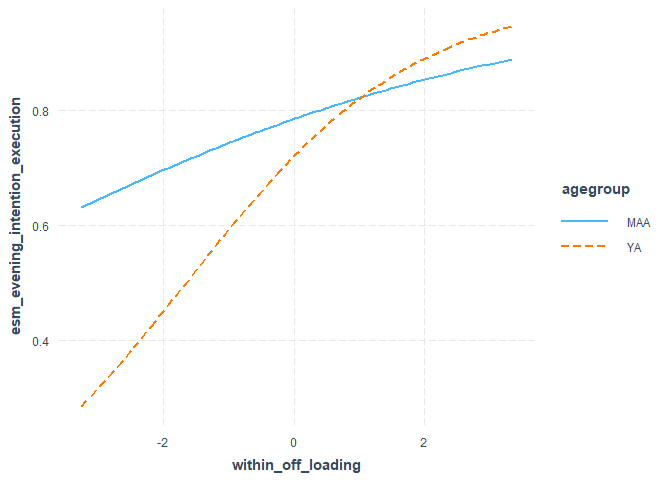

``` r
# # get the posterrior samples
# draws<-posterior_samples(fit1)
# 
# # Compute indirect effect manually
# draws$indirect <- draws$b_withinoffloading_within_importance * # path a - M~A
#   draws$b_esmeveningintentionexecution_within_off_loading  # path b - Y~M

# # plot distribution
# ggplot(draws, aes(x = indirect))+
#   geom_histogram()+
#   theme_classic()+
#   gg_title("posterior distribution indirect effect of intention on PM")

#indirect_bf <- bayesfactor_parameters(draws$indirect)

#plot(bayesfactor_parameters(draws$indirect))

# draws$indirect2 <- draws$b_withintaskmonitoring_within_business*  draws$b_esmeveningintentionexecution_within_task_monitoring 
# 
# 
# hist(draws$indirect)
# 
# hist(draws$indirect2)
# 
# # simple slope analysis for the interaction between age group and within task monitoring
# slope_MA <- draws$b_esmeveningintentionexecution_within_off_loading  +
#   draws$`b_esmeveningintentionexecution_agegroup.c:within_off_loading` * 0.5
# slope_YA <- draws$b_esmeveningintentionexecution_within_off_loading  +
#   draws$`b_esmeveningintentionexecution_agegroup.c:within_off_loading`  -0.5+0.5
# 
# describe_posterior(slope_MA)
# describe_posterior(slope_YA)
# 
# conditional_effects(fit1, "within_off_loading", resp = "esmeveningintentionexecution")
# 
# ce <- conditional_effects(fit1, effects = "within_off_loading:agegroup.c",
#                           conditions = data.frame(agegroup.c = c(-0., 0.52)))
# 
# plot(ce)

# stronger in young adults than in middle aged adults
```

## Posterior predictive check

PPC constructs the posterior distribution over the parameters and
simulate their distribution - if it approximates the distribution of
observed data, the model is a good fit

Prospective memory

``` r
pp_check(fit1, resp = "esmeveningintentionexecution")
```

    Using 10 posterior draws for ppc type 'dens_overlay' by default.

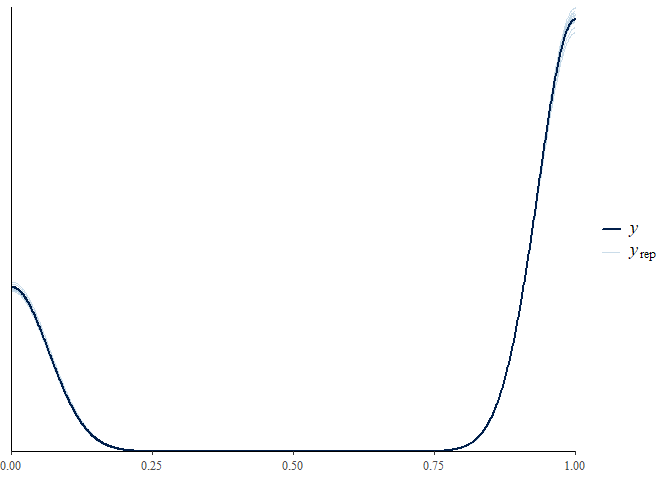

## Posterior predictive check

Task Monitoring

``` r
pp_check(fit1, resp = "esmdaytaskmonitoring")
```

    Using 10 posterior draws for ppc type 'dens_overlay' by default.

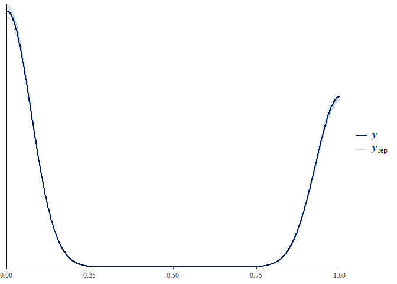

## Posterior predictive check

Off Loading

``` r
pp_check(fit1, resp = "esmeveningoffloadingr")
```

    Using 10 posterior draws for ppc type 'dens_overlay' by default.

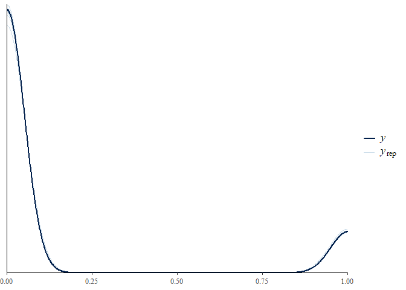
