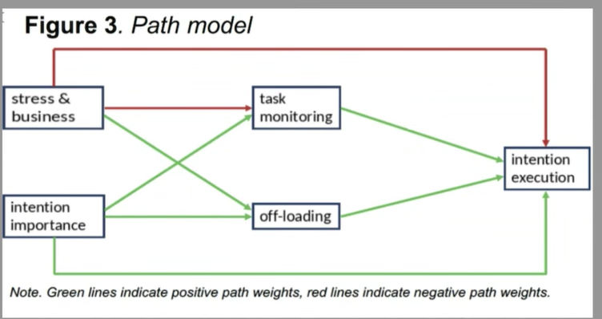

```{r includeLfalse}
#| message: false
#| warning: false
#| include: false


#import libraries
# library(haven)
# library(dplyr)
# library(gt)
# library(lme4)
# library(performance) # for ICC
# library(sjPlot)
# library(brms)
# library(ggplot2)
# library(bayestestR)
# library("paraeters")


packages <- c("brms", "dplyr", "haven", "gt", "lme4",
              "performance", "sjPlot","ggplot2", "bayestestR",
              "rstudioapi", "parameters", "car","interactions" )

# Install any packages not yet installed
installed <- packages %in% rownames(installed.packages())
if (any(!installed)) {
  install.packages(packages[!installed])
}

# Load all packages
lapply(packages, library, character.only = TRUE)

```

## Original Path model

This it the original path model to be tested :



## Extended model

This model can be extended to accommodate partition of variance between- and within- participants:


## Within-between partitioning


## Effect of stress


## Effect of business


## Effect of Importance


```{r}
# Import the data
#| include: false
#| message: false
#| warning: false
#| echo: false
cd<-getwd()

# file dir
file_dir<-"Originaldatensätze/R-Skript"

# young adults' dataset
YA_df<- read_spss(paste0(file_dir, "/ExpSamp_jungErw2.sav"))

# rename the age group
YA_df$agegroup<-"YA"

# check task_monitoring
hist(YA_df$esm_day_task_monitoring)

# middle-aged adults
MAA_df<-read_spss(paste0(file_dir, "/ExpSamp_mittlErw.sav"))

# rename the age group
MAA_df$agegroup<-"MAA"

# check task_monitoring
hist(YA_df$esm_day_task_monitoring)

# combine the two
all_df<-rbind(YA_df, MAA_df)
```

## Participants

```{r}

all_df %>%
  distinct(ID, agegroup) %>%
  count(agegroup, name = "n_participants") %>%
  gt() %>%
  tab_header(
    title = "Participants by age group"
  )

# check the length of unique IDs
length(unique(all_df$ID))
```

## 

the df looks like this:

```{R}
#| echo: false

head(all_df, 20, keepnums =c(7,8))

```

## Preprocessing

-   Rescale PM to range between 0 and 1

```{r}
all_df$esm_evening_intention_execution<-ifelse(all_df$esm_evening_intention_execution ==-1, 0, all_df$esm_evening_intention_execution)
```

## Monitoring

```{r}
hist(all_df$esm_day_task_monitoring)


# all_df$esm_day_task_monitoring_r<-ifelse(all_df$esm_day_task_monitoring ==-1, 0, 
#                                          ifelse(all_df$esm_day_task_monitoring== 0, 0, 1))


```

## Rescale offloading

```{r}

hist(all_df$esm_evening_off_loading)

all_df$esm_evening_off_loading_r<-ifelse(all_df$esm_evening_off_loading ==-1, 0,1)

hist(all_df$esm_evening_off_loading_r)

```

## Reshaping

-   The dataset as it is now is good to test hypotheses on the variables that vary within day, e.g. stress, business, monitoring.
-   Reshape the dataset so there is only one unique intention per day, which is our base level.

RTeshaped dataset

```{r}
#| echo: false
# create stress and business averaged
stress_day <- all_df %>%
  group_by(ID, day) %>%
  summarise(
    mean_stress = mean(esm_day_stress, na.rm = TRUE),
    mean_business = mean(esm_day_business, na.rm = TRUE)
  )

# Merge with intention-level data
stress_int <- all_df %>%
  left_join(stress_day, by = c("ID", "day"))

# create within-particiapnts deviations
stress_int <- stress_int %>%
  # Step 1: Compute grand mean
  mutate(grand_mean_esm_stress = mean(mean_stress, na.rm = TRUE)) %>%
  mutate(grand_sd_esm_stress = sd(mean_stress, na.rm = TRUE)) %>%
  
  mutate(grand_mean_esm_day_business = mean(mean_business, na.rm = TRUE)) %>%
  mutate(grand_sd_esm_day_business = sd(mean_business, na.rm = TRUE)) %>%
  
  mutate(grand_mean_esm_day_task_monitoring = mean(esm_day_task_monitoring, na.rm = TRUE)) %>%
  mutate(grand_sd_esm_day_task_monitoring = sd(esm_day_task_monitoring, na.rm = TRUE)) %>%
  
  mutate(grand_mean_esm_evening_off_loading = mean(esm_evening_off_loading_r, na.rm = TRUE)) %>%
  mutate(grand_sd_esm_evening_off_loading = sd(esm_evening_off_loading_r, na.rm = TRUE)) %>%
  
  mutate(grand_mean_esm_evening_intention_importance_t1= mean(esm_evening_intention_importance_t1, na.rm = TRUE)) %>%
  mutate(grand_sd_esm_evening_intention_importance_t1= sd(esm_evening_intention_importance_t1, na.rm = TRUE)) %>%
  
  # Step 2: Compute person-level means
  group_by(ID) %>%
  mutate(mean_stress_person = mean(mean_stress, na.rm = TRUE)  ) %>%
  mutate(mean_business_person= mean(mean_business, na.rm = TRUE) ) %>%
  mutate(mean_task_monitoring_person= mean(esm_day_task_monitoring, na.rm = TRUE)) %>%
  mutate(mean_off_loading_person= mean(esm_evening_off_loading_r, na.rm = TRUE)) %>%
  mutate(mean_importance_person= mean(esm_evening_intention_importance_t1, na.rm = TRUE)) %>%
  
  # Step 3: Compute person-level mean deviation from grand mean
  group_by(ID) %>%
  mutate(between_stress = (mean_stress_person -grand_mean_esm_stress)/grand_sd_esm_stress ) %>%
  mutate(between_business= (mean_business_person - grand_mean_esm_day_business)/grand_sd_esm_day_business) %>%
  mutate(between_task_monitoring= (mean_task_monitoring_person -grand_mean_esm_day_task_monitoring)/grand_sd_esm_day_task_monitoring)  %>%
  mutate(between_off_loading= (mean_off_loading_person- grand_mean_esm_evening_off_loading)/grand_sd_esm_evening_off_loading) %>%
  mutate(between_importance= (mean_importance_person-grand_mean_esm_evening_intention_importance_t1)/grand_sd_esm_evening_intention_importance_t1) %>%
  
  # Step 3: Compute within-person deviation
  mutate(within_stress = (mean_stress - mean_stress_person))%>%
  mutate(within_business = (mean_business - mean_business_person)) %>%
  mutate(within_task_monitoring = (esm_day_task_monitoring - mean_task_monitoring_person)) %>%
  mutate(within_off_loading = (esm_evening_off_loading_r - mean_off_loading_person)) %>%
  mutate(within_importance = (esm_evening_intention_importance_t1 - mean_importance_person)) %>%
  
  ungroup()


# select only the the first intention
stress_int_red<-stress_int %>%
  group_by(ID, day,  intention) %>%
  slice_sample(n = 1) 

# scale all the predictors
for (var in c("between_stress", "between_business","between_task_monitoring", "between_off_loading", 
              "between_importance", "within_stress", "within_business","within_task_monitoring", 
              "within_off_loading","within_importance"  )){
  
  stress_int_red[[var]]<-scale(stress_int_red[[var]])
  
}

# plot it 
head(stress_int_red, 20)
```

## Some particiants have more or less intention per day

```{r}
#| echo: false
# delete nas
stress_int_red_noNA<-stress_int_red[nchar(stress_int_red$intention)>0, ]

count_cases<-stress_int_red_noNA %>%
  group_by(ID, day) %>%
  tally()

print("Number of unique intentions per day")
unique(count_cases$n)

# there are sometimes 4 and 1 and 2
print("Participants who reported 4 intentions in some days:")
unique(count_cases$ID[count_cases$n==4])
```

## Distributions

```{r}
library(tidyr)

# Select the variables you want histograms for
df_selected <- stress_int_red %>%
  select(within_stress, within_importance, within_business, 
         within_off_loading, within_task_monitoring, 
         esm_evening_intention_execution,esm_day_task_monitoring,esm_evening_off_loading_r )  

df_selected<-df_selected[, c("within_stress", "within_importance", "within_business", 
                             "within_off_loading", "within_task_monitoring", 
                             "esm_evening_intention_execution", "esm_day_task_monitoring", 
                             "esm_evening_off_loading_r")]

# Convert to long format
df_long <- df_selected %>%
  pivot_longer(cols = everything(), names_to = "Variable", values_to = "Value")

# Plot all histograms in one go using facets
ggplot(df_long, aes(x = Value)) +
  geom_histogram(bins = 30, fill = "grey70", color = "black") +
  facet_wrap(~ Variable, scales = "free") +
  theme_classic()
```

## Check the intraclass correlation coefficient (ICC)

```{r}

PM_YA <- glmer(esm_evening_intention_execution ~ 1 + (1 | ID), 
               data = stress_int[stress_int$agegroup=="YA",], family = binomial)

PM_MAA <- glmer(esm_evening_intention_execution ~ 1 + (1 | ID), 
                data = stress_int[stress_int$agegroup=="MAA",], family = binomial)

print("ICC PM YA:")
icc_YA<-icc(PM_YA)
icc_YA$ICC_adjusted

print("ICC PM MAA:")
icc_MAA<-icc(PM_MAA)
icc_MAA$ICC_adjusted

```

## Test the effect of day on intention execution

```{r}
#| echo: false
# first, center time
stress_int_red$day.c<-scale(stress_int_red$day, scale = F)

# center agegroup
stress_int_red$agegroup.c<-ifelse(stress_int_red$agegroup=="YA", -0.5, 0.5)

PM_time_model<-glmer(esm_evening_intention_execution ~ day.c*agegroup.c + (day.c|ID), 
                     data = stress_int_red, family = binomial(),
                     control=glmerControl(optimizer="bobyqa",optCtrl=list(maxfun=100000)) )

tab_model(PM_time_model)
```

## Do people become more stressed as the go on with the study?

```{r}

stress_time_model<-lmer(esm_day_stress_avg ~ day.c*agegroup.c + (day.c|ID), 
                        data = stress_int_red, 
                        control=lmerControl(optimizer="bobyqa",optCtrl=list(maxfun=100000)) )

tab_model(stress_time_model)
```

## Conditional effects of variables on PM

Test the conditional effects of the variables on PM

```{R}
#| echo: true
#| eval: false

# predict PM by all the predictors
PM_model<- glmer(esm_evening_intention_execution ~ 
                   # within factors
                   within_off_loading+
                   within_importance +
                   within_task_monitoring+
                   within_business+
                   within_stress+
                   # between factors
                   between_off_loading+
                   between_importance+
                   between_task_monitoring+
                   between_business+
                   between_stress+  
                   # age
                   agegroup.c +  
                   # day number as covariate
                   day.c+
                   # random effects
                   (1 within_off_loading+
                      within_importance +
                      within_task_monitoring+within_business+day.c| ID),
                 data = stress_int_red, family = binomial,
                 control=glmerControl(optimizer="bobyqa",optCtrl=list(maxfun=100000)) 
)


```

## Results

```{r}
#| eval: false
#| include: false
load("PM_model.Rdata")

print("VIF:")
vif(PM_model)

summary(PM_model) 
```

## SEM - path model. Generalized linear-mixed effect path model - bayesian estimation

```{R}
#| eval: false
#| echo: true

# first, we predict PM from all the predictors
PM_model <-bf(esm_evening_intention_execution ~  # fixed effects 
                within_stress*agegroup.c + 
                within_importance*agegroup.c + 
                within_task_monitoring*agegroup.c + 
                within_off_loading*agegroup.c +
                within_business*agegroup.c+
                between_stress*agegroup.c + 
                between_task_monitoring*agegroup.c + 
                between_off_loading*agegroup.c +
                between_importance*agegroup.c+
                between_business*agegroup.c+day.c+
                (1 + within_stress +
                   within_business+
                   within_importance + 
                   within_task_monitoring + 
                   within_off_loading || ID), # random intercepts and slopes
              family = bernoulli()) # we have a binary outcome

# predicting monitoring from stress and importance
monitoring_model<- bf(esm_day_task_monitoring ~ 
                        within_stress*agegroup.c +
                        within_importance*agegroup.c +
                        within_business*agegroup.c+
                        between_stress*agegroup.c+
                        between_importance*agegroup.c+
                        between_business+day.c+
                        (1+within_stress+
                           within_business+
                           within_importance+
                           day.c||ID), 
                      family = bernoulli()) # mixture

# predicing off_loading from stress and imortance
offloading_model<-bf(esm_evening_off_loading_r ~ 
                       within_stress*agegroup.c +
                       within_importance*agegroup.c+
                       within_business*agegroup.c+
                       between_stress*agegroup.c+
                       between_importance*agegroup.c+
                       between_business*agegroup.c+ day.c+
                       (1+within_stress+
                          within_importance+
                          within_business+
                          day.c||ID), family = bernoulli() )#

# set weakly informative priors
priors <- c(
  # Fixed effects: assume standardized predictors
  prior(normal(0, 0.5), class = "b", resp = "esmeveningintentionexecution"),   
  prior(normal(0, 0.5), class = "b", resp = "esmdaytaskmonitoring"),  
  prior(normal(0, 0.5), class = "b", resp = "esmeveningoffloadingr")   
  
# all the rest is left as defauls
 #  
 #  # SD of random effects (hierarchical structure)
 #   prior( student_t(3, 0, 2.5) , class = "sd", resp = "esmeveningintentionexecution"),
 #  prior(student_t(3, 0, 2.5) , class = "sd", resp = "esmdaytaskmonitoring"),
 #   prior(student_t(3, 0, 2.5), class = "sd", resp = "esmeveningoffloadingr"),
 #  #
 #  # Correlation priors among random effects
 # # prior(lkj(2), class = "cor"),  # same across responses
 # 
 #  # Residual SDs for continuous outcomes
 #  prior(exponential(1), class = "sigma", resp = "esmdaytaskmonitoring"),
 #  prior(exponential(1), class = "sigma", resp = "esmeveningoffloadingr")
)


# fit thestress_int_red# fit the model
fit1 <- brm(
  PM_model+
    monitoring_model + 
    offloading_model + 
    set_rescor(F), 
  prior = priors,
  sample_prior = "yes",
  data = stress_int_red,
  chains = 4, cores = 4,
  iter = 2000, 
  warmup = 1000
  #,backend = "cmdstanr"  
)
```

## Posterior summary

```{r}
#| echo: false

load("final_mod_prior_0.5.Rdata")

#posterior_summary <- model_parameters(fit1, centrality = "median", ci = 0.95)

#post_fit<-describe_posterior(fit1, ci=0.95)

# sort them
posterior_summary_sorted <- posterior_summary %>%
  filter(grepl("^b_", Parameter)) %>%  # optional: only fixed effects
  arrange((Median)) %>%
  
  # arrange(abs(Median)) %>%
  mutate(Parameter = factor(Parameter, levels = Parameter))  # preserve sort order

# 
# delete the intercepts
intercepts<-posterior_summary_sorted$Parameter[grep(pattern  = "_Intercept",x = posterior_summary_sorted$Parameter)]

posterior_summary_sorted<-posterior_summary_sorted[!posterior_summary_sorted$Parameter
                                                   %in% intercepts, ]

ggplot(posterior_summary_sorted, aes(x = Parameter, y = Median)) +
  geom_point() +
  #geom_histogram()+
  geom_errorbar(aes(ymin = CI_low, ymax = CI_high), width = 0.2) +
  coord_flip() +
  theme_minimal() +
  geom_hline(yintercept = 0, linetype = "dashed", color = "red", linewidth = 1)+
  labs(
    title = "Posterior Estimates (Sorted by Effect Size)",
    y = "Median Estimate (with 95% CI)",
    x = "Parameter"
  )

library(ggdist)  # for stat_halfeye


#bf
#save(list=ls(), file = "final_mod_prior_0.5.Rdata")

```

## Path model results


```{R}
#| eval: false
#| include: false
# plot offloading
mcmc_plot(fit1,
          type = "areas",
          prob = 0.95, 
          variable =  "^b_withinoffloading_", regex = T)

# PM
# mcmc_plot(fit1,
# type = "areas",
# prob = 0.95, 
# variable =  "^b_esmeveningintentionexecution_", regex = T)
# 
# # task monititoring
# mcmc_plot(fit1,
# type = "areas",
# prob = 0.95, 
# variable =  "^b_withintaskmonitoring_", regex = T)

h_importance_PM<-hypothesis(fit1,  c("esmeveningintentionexecution_within_importance=0" ))
print(h_importance_PM)

w_importance_offload<-hypothesis(fit1,  c("esmeveningoffloadingr_within_importance=0" ))
print(w_importance_offload)

h_offloading_PM<-hypothesis(fit1,  c("esmeveningintentionexecution_within_off_loading=0" ))
print(h_offloading_PM)

h_business_PM<-hypothesis(fit1,  c("esmeveningintentionexecution_within_business=0" ))

print(h_business_PM)

h_betwoffload_PM<-hypothesis(fit1,  "esmeveningintentionexecution_between_off_loading=0")
print(h_betwoffload_PM)

h_off_age_PM<-hypothesis(fit1,  "esmeveningintentionexecution_agegroup.c:within_off_loading
=0")

h_bus_monitor<-hypothesis(fit1,  "esmdaytaskmonitoring_within_business=0")

betw_stess_age_mon<-hypothesis(fit1,  "esmdaytaskmonitoring_agegroup.c:between_stress=0")

between_importance_monitor<-hypothesis(fit1,  "esmdaytaskmonitoring_agegroup.c:between_stress=0")

h_importance_age_monitor<-hypothesis(fit1,  "esmdaytaskmonitoring_agegroup.c:within_importance=0")
print(h_importance_age_monitor)


# test whether task monitoring affect PM
h_monitoring_PM<-hypothesis(fit1,  c("esmeveningintentionexecution_within_task_monitoring=0" ))
print(h_monitoring_PM)

stress_offloading<-hypothesis(fit1,  c("esmeveningoffloadingr_within_stress=0" ))
print(stress_offloading)

# test mediation with task monitoring
h2<-hypothesis(fit1,  c("esmeveningintentionexecution_within_task_monitoring*
                       withintaskmonitoring_within_business =0"  ))
print(h2)
```

## Moderation of Age group on between stress-within task monitoring path

```{R}
int_mod_stess_mon<-glmer(esm_day_task_monitoring~between_stress*agegroup +(1|ID),
               family = binomial(),
               data = stress_int_red, )


tab_model(int_mod_stess_mon)


int_mod_stress_mon<-glmer(esm_day_task_monitoring~day.c+ esm_day_stress*agegroup +(1+day.c+esm_day_stress|ID),
               family = binomial(),
               data = stress_int_red )


tab_model(int_mod_stress_mon)

interact_plot(int_mod_stress_mon, pred = esm_day_stress, modx = agegroup)

 ggplot(stress_int_red, 
         aes( x=esm_day_stress, y=esm_day_task_monitoring))+
  # add the "smooth" line, which the regression method ('l,')
  # and trasparent (0.5)
    geom_line(stat="smooth",method = "glm", formula=y~x, alpha=0.5, se=F)+

  # specify that we want different colours for different participants
    aes(colour = factor(ID))+
  # add the summary line with geom_smooth
    geom_smooth(method="lm",formula=y~x, se=T, colour = "black" )+
    theme(strip.text.x = element_text(size = 13))+
    theme_classic()+
    theme(panel.spacing = unit(1, "lines"))+
    facet_wrap(.~agegroup)+
    #ggtitle("Experiment 2")+
    theme(legend.position = "none")
```

## Plot moderation of Age group on between stress-within task monitoring path

```{R}
library(interactions)
interact_plot(int_mod_stess_mon, pred = between_stress, modx = agegroup)
```

## Test the mediation of monitoring

```{R}
h_business_monitoring<-hypothesis(fit1,  c("esmeveningintentionexecution_within_task_monitoring*esmdaytaskmonitoring_within_business =0"  ))

plot(h_business_monitoring)

print(h_business_monitoring)

print(paste0("Bayes Factor for ", "h_mediation"," is ", 1/h_business_monitoring$hypothesis$Evid.Ratio))
```

## Test moderated mediation - Age as moderator, off-loading as a mediator

```{R}
#| eval: false
#| include: true
#| 
h_moderated_mediation<-hypothesis(fit1,  c("esmeveningintentionexecution_agegroup.c:within_off_loading* esmeveningoffloadingr_within_importance = 0"  ))

BF_moderated_med<-1/h_moderated_mediation$hypothesis$Evid.Ratio
print(paste0("Bayes Factor for ", "h_moderated_mediation"," is ", 1/h_moderated_mediation$hypothesis$Evid.Ratio))


```

## Moderation model

```{r}
#| echo: false
int_mod<-glmer(esm_evening_intention_execution~within_off_loading*agegroup +(within_off_loading|ID),
               family = binomial(),
               data = stress_int_red, )


summary(int_mod)

```

## Plot moderation

```{R}

interact_plot(int_mod, pred = within_off_loading, modx = agegroup)

# # get the posterrior samples
# draws<-posterior_samples(fit1)
# 
# # Compute indirect effect manually
# draws$indirect <- draws$b_withinoffloading_within_importance * # path a - M~A
#   draws$b_esmeveningintentionexecution_within_off_loading  # path b - Y~M

# # plot distribution
# ggplot(draws, aes(x = indirect))+
#   geom_histogram()+
#   theme_classic()+
#   gg_title("posterior distribution indirect effect of intention on PM")

#indirect_bf <- bayesfactor_parameters(draws$indirect)

#plot(bayesfactor_parameters(draws$indirect))

# draws$indirect2 <- draws$b_withintaskmonitoring_within_business*  draws$b_esmeveningintentionexecution_within_task_monitoring 
# 
# 
# hist(draws$indirect)
# 
# hist(draws$indirect2)
# 
# # simple slope analysis for the interaction between age group and within task monitoring
# slope_MA <- draws$b_esmeveningintentionexecution_within_off_loading  +
#   draws$`b_esmeveningintentionexecution_agegroup.c:within_off_loading` * 0.5
# slope_YA <- draws$b_esmeveningintentionexecution_within_off_loading  +
#   draws$`b_esmeveningintentionexecution_agegroup.c:within_off_loading`  -0.5+0.5
# 
# describe_posterior(slope_MA)
# describe_posterior(slope_YA)
# 
# conditional_effects(fit1, "within_off_loading", resp = "esmeveningintentionexecution")
# 
# ce <- conditional_effects(fit1, effects = "within_off_loading:agegroup.c",
#                           conditions = data.frame(agegroup.c = c(-0., 0.52)))
# 
# plot(ce)

# stronger in young adults than in middle aged adults
```

## Posterior predictive check

PPC constructs the posterior distribution over the parameters and simulate their distribution - if it approximates the distribution of observed data, the model is a good fit

Prospective memory

```{R}
pp_check(fit1, resp = "esmeveningintentionexecution")

```

## Posterior predictive check

Task Monitoring

```{R}
pp_check(fit1, resp = "esmdaytaskmonitoring")

```

## Posterior predictive check

Off Loading

```{R}
pp_check(fit1, resp = "esmeveningoffloadingr")

```
